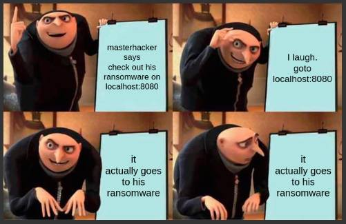

# CompTIA Security+ (Sec+) Review
Note: Links to resources are at the bottom of the page. 

## How I studied
I utilized the TestOut software which included pdf notes, videos, labs, quizzes, and a test at the end of the course. The content was good, but it taught things in addition to security+ so you could pass their own in house version of security+. I really only wanted to study security+ and could care less about their own certification but the material was so intertwined you couldn't get around it. The labs were nice, but 10% of the time, they would break and it'd be really annoying to reload everything. I took notes on every video and completed 95% of the labs. The end of section quizzes were close to what compTIA has in their study guides.After completing the course, I created a stack of about 300 flash cards with various terms from the objectives sheet and other things that could fall under a blanket term within the objectives. After several days of going through the stack I started taking practice exams.  I bought Jason Dions Security+ exams on Udemy and was scoring mid 80s. After browsing reddit and seeing how peoples scores translate to the actual test I believed I was ready. 

## Test Tips:
Save the PBQs for last and if you have time triple check the multiple choice questions. The test itself felt like a vocab test, where if you could define the terms that it listed as answers, you didn't need to do any critical thinking. 

## If I were to study again
Professor Messer has a free YouTube video series online that covers all the required exam material. I highly reccomend it as I watched some of his videos to reinforce concepts that I was confused on in TestOut. Take notes on paper as it definitely helps retain the material more. And create flashcards with any terms you are struggling on. The practice tests by Jason Dion on Udemy were extremely helpful for knowing what you need to study. I couldn't of passed without them. For the PBQs, as long as you know the content, they are easy. There is a guy named Cyberkraft on YouTube that works through PBQs and is really helpful for knowing what to expect on exam day.

## In Summary
This was my first cyber certification so I really hammered down on studying. This certification is more content heavy and like other CompTIA exams, it is a mile wide but only an inch deep. It`s overall worth it as more and more internships are wanting to see security+. 

## Links to Resources mentioned:
- [TestOut (Price Varies)](https://w3.testout.com/courseware/security-pro)
- [Dion Udemy Tests ($20)](https://www.udemy.com/course/security-601-exams/)
- [Cyberkraft YT](https://www.youtube.com/@cyberkraft539)

Thank you for reading!

\- Sharp

