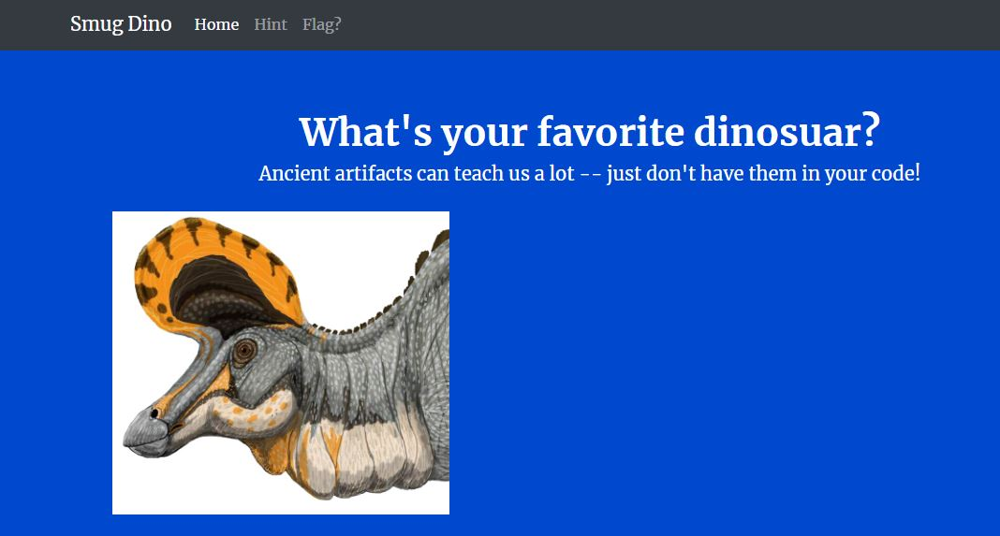

## Reconnaissance

Opening the challenge we are presented with the website `http://web.csaw.io:3009/` as shown below:

We are greeted with a picture of a dinosaur and two more pages we can visit.

Clicking on `Hint` leads us to `http://web.csaw.io:3009/hint` which reveals a mostly blank webpage with the form below.

Clicking on `Flag?` reveals a failed request to `http://localhost:3009/flag.txt`

Since we cannot access the webpage due to it being hosted internally (localhost), lets go back to `http://web.csaw.io:3009/hint`

Opening Burpsuite and sending an unmodified request to `http://web.csaw.io:3009/hint` reveals the following response information:

The response header “Server” reveals `nginx/1.17.6`. Given this new information, we can submit the form on the /hint page and put “nginx” as the server name and “1.17.6” as the server version. When submitting the form, we get:

Following the redirect and rendering, we are greeted with:

Awesome! 

These hints give us a ton of information that 

- /flag.txt is only accessible via localhost
- 302 redirections are being used to handle 401 errors
- An exploit we could use to retrieve the flag came out in 2019

Moving forward, a simple google search of “nginx cve 2019” (Server name and CVE year) reveals the following website →  [CVE-2019-20372 Details](https://nvd.nist.gov/vuln/detail/CVE-2019-20372#:~:text=CVE%2D2019%2D20372%20Detail&text=NGINX%20before%201.17.,fronted%20by%20a%20load%20balancer).

From [NIST](https://nvd.nist.gov/vuln/detail/CVE-2019-20372#:~:text=CVE%2D2019%2D20372%20Detail&text=NGINX%20before%201.17.,fronted%20by%20a%20load%20balancer): “NGINX before 1.17. 7, with certain error_page configurations, **allows HTTP request smuggling**, as demonstrated by the ability of an attacker to read unauthorized web pages in environments where NGINX is being fronted by a load balancer.”

Given that we are trying to retrieve a flag from a nginx server version 1.17.6, this sounds great!

## Preparing the exploit:

According to [Portswigger](http://portswigger.net) “the HTTP/1 specification provides two different ways to specify where a request ends: the Content-Length header and the Transfer-Encoding header.” The vulnerability arises when the front end interprets the request differently from the backend. For the HTTP/1 specification, if both are used at the same time they can conflict with each other. If both of the headers (Content-Length and Transfer-Encoding) are included, then Content-Length is ignored. 

Transfer encoding specifies the form of encoding used to transfer the payload. One option for transfer encoding is chunked, which means the message contains one or more chunks of data terminated by a chunk of size 0.

In order to smuggle a request to our flag location at `http://localhost:3009/flag.txt`, we can edit our request with our username and password to `http://web.csaw.io:3009/hint`

In order to keep our connection open for multiple requests, we need to change the Connection header in our request from `close` to `keep-alive`. We can then add the `Transfer-Encoding` header and set it to `chunked` which allows us to split the payload body into multiple chunks. We can first end the current chunk by writing a zero to the body. 

We can then specify our flags location in a get request `GET /flag.txt HTTP/1.1` followed by the Host header of `localhost:3009` on a newline below it. To ensure the chunk is terminated we can enter a newline followed by a zero.

The resulting request and response should look like this:

And nice! We got the flag `csawctf{d0nt_smuggl3_Fla6s_!}`

## Resources:
- [Portswigger Req. Smuggling](https://portswigger.net/web-security/request-smuggling)
  - Portswigger is a fantastic resource for all things Web Security^^^^
- [HackTricks HTTP Req. Smuggling](https://book.hacktricks.xyz/pentesting-web/http-request-smuggling)
- [Mozilla Developer Docs Transfer-Encoding](https://developer.mozilla.org/en-US/docs/Web/HTTP/Headers/Transfer-Encoding)

Thank you for reading

\- Sharp

 

  
  
  
  
  
  
  
  
  

